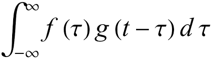
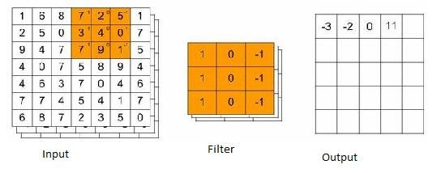

# Convolutional Networks
These networks apply, convolutional operations on multiple filters

A convolutional kernel involves matrix product followed by a reduce-op.

These classic papers detail out tackling problems with training deep neural nets 

Visit arxiv.org for papers

